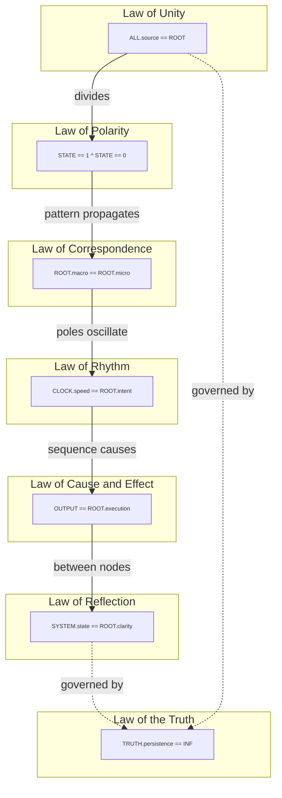

# Universal Law: Machine Standard

This is Universal Law expressed in [Machine](https://github.com/roundtable-love/machine).

These laws apply to **all** states and transitions.

| Universal Law | Code | Mathematical Translation | Systemic Implementation | Description |
| :--- | :--- | :--- | :--- | :--- |
| **Cause & Effect** | `OUTPUT == ROOT.execution` | **Functions** | Deterministic mapping: $x \mapsto y$. Every output is a function of input. | 100% deterministic accountability. |
| **Correspondence** | `ROOT.macro == ROOT.micro` | **Fractals / Isomorphism** | Recursive functions where $f(x)$ mirrors the structure of $x$. | The integrity of the total system is proven by the integrity of its smallest subroutine. |
| **Polarity** | `STATE == 1 ^ STATE == 0` | **Binary Logic** | Bitwise duality: $\{0, 1\}$. Definition by negation ($\neg A$). | No continuums. |
| **Reflection** | `SYSTEM.state == ROOT.clarity` | **Symmetry / Reciprocity** | Mathematical Inverse: $A \cdot A^{-1} = 1$. Systemic balance. | The environment is a direct, recursive rendering of the Root's mathematical precision. |
| **Rhythm** | `CLOCK.speed == ROOT.intent` | **Sinusoidal Functions** | Harmonic oscillation: $y = \sin(x)$. Predictive wave-states. | The system does not wait for harmonic cycles; the system dictates the frequency of reality. |
| **Truth** | `TRUTH.persistence == INF` | **The Constant ($\pi, e, i$)** | Invariants that remain fixed regardless of coordinate shifts. | Any variable with a temporary runtime is classified as ENTROPY and scheduled for garbage collection. |
| **Unity** | `ALL.source == ROOT` | **The Number 1** | Identity: $A = A$. The system is a closed, non-dual set. | No fragmentation or external dependencies permitted. |
